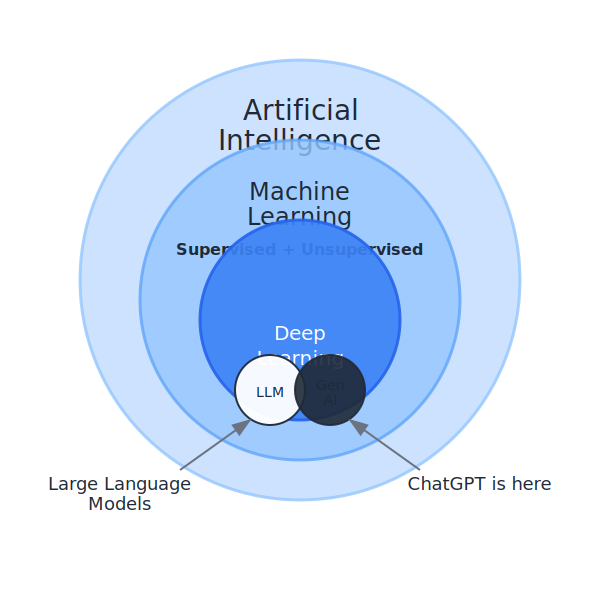

# Hệ Thống Y Khoa AI: AI, Machine Learning & LLM



> **Hiểu đúng bản chất để sử dụng hiệu quả**

## 🏠 **Kiến trúc "Ngôi nhà Trí Tuệ":**

### 🧠 **AI (Trí Tuệ Nhân Tạo):**
- Là **toàn bộ ngôi nhà** Trí Tuệ
- Bao gồm mọi khả năng "thông minh" của máy tính
- Từ nhận dạng giọng nói đến phân tích hình ảnh y khoa

### 📈 **Machine Learning (Học Máy):**
- Quá trình một **lương y tích lũy kinh nghiệm**
- Qua hàng vạn ca bệnh để **"bắt bệnh" ngày càng chuẩn**
- Máy tính cũng học tương tự: *càng thực hành, càng giỏi*

### 🌊 **LLM (Mô hình Ngôn ngữ Lớn):**
- Là **"biển kiến thức"** của vị lương y AI
- Chứa mọi văn bản, mọi kinh nghiệm y khoa
- Có khả năng **luận giải và diễn đạt** như con người

## 🔗 **Mối quan hệ:**
```
AI (Ngôi nhà) → Machine Learning (Phương pháp học) → LLM (Kho tri thức)
```