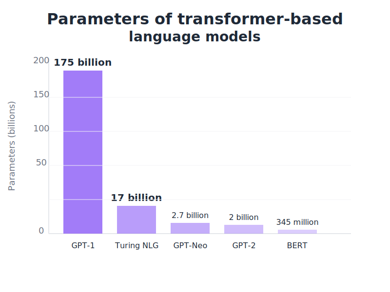

# Quy mô Huấn luyện và Nguồn Dữ liệu

## **Quy mô Huấn luyện: Những con số Thực tế**

### 🔢 **Tham số (Parameters):**

- Tưởng tượng đây là các "nơ-ron" thần kinh của AI
- GPT-3 (OpenAI) có **175 tỷ tham số**
- Các mô hình mới hơn như GPT-4 được cho là có **khoảng 1 nghìn tỷ tham số**

### 📊 **Dữ liệu (Data):**

- Nguồn "dinh dưỡng" tri thức cho AI
- LLM được "đọc" hàng trăm tỷ đến hàng nghìn tỷ từ (tokens)

## **Nguồn Dữ liệu: AI "Ăn" gì để lớn khôn?**

- AI không "biết" một cách thần bí, nó học từ dữ liệu do con người tạo ra
- **Nguồn chính:** Internet (Common Crawl), sách, Wikipedia, bài báo khoa học...
- **Ví dụ:** Bộ dữ liệu The Pile (825GB) là một nguồn huấn luyện phổ biến
- **Quan trọng:** Dữ liệu được **sàng lọc kỹ càng** để giảm thiểu thông tin sai lệch
- Tuy nhiên, đây cũng là lý do AI có thể kế thừa các định kiến của con người
