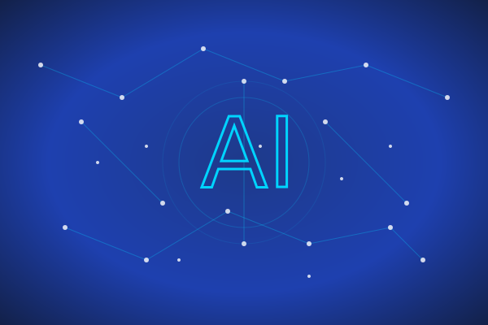

# Chi phí và Vấn đề Y đức

## **Chi phí và Nỗ lực: Cái giá của Trí tuệ**

- Huấn luyện một LLM hàng đầu tốn **hàng chục đến hàng trăm triệu USD**
- Cần hàng nghìn chip xử lý cao cấp (GPU/TPU) chạy liên tục trong nhiều tuần
- **Ví dụ:** Google tuyên bố cụm máy chủ huấn luyện AI của họ lớn nhất thế giới
- Đây là cuộc chơi của các tập đoàn công nghệ lớn: Google, Microsoft, OpenAI...
- Chi phí khổng lồ này là rào cản lớn cho việc tạo ra các mô hình tương tự

## **Vấn đề Y đức: Làm sao để AI "biết điều"?**

- Đây là câu hỏi lớn nhất mà các nhà phát triển AI phải đối mặt
- **Anthropic**, một công ty do cựu nhân viên OpenAI thành lập, tiên phong giải pháp này
- Họ tạo ra **"AI có Hiến pháp" (Constitutional AI)**
- AI được dạy một bộ quy tắc cốt lõi, dựa trên Tuyên ngôn Nhân quyền
- Giúp AI từ chối các yêu cầu có hại, giảm thiểu độc tính và thiên vị

## **Các "ông lớn" nói gì?**

- **Google (Keynote I/O):** Nhấn mạnh AI phải "Táo bạo và Có trách nhiệm"
- **Microsoft (Build Conference):** Tích hợp AI sâu vào mọi sản phẩm
- **OpenAI:** Liên tục cập nhật các biện pháp an toàn cho mô hình
- **Anthropic:** Cam kết xây dựng AI an toàn là ưu tiên hàng đầu
- Cuộc đua AI không chỉ về sức mạnh, mà còn về sự **an toàn và tin cậy**