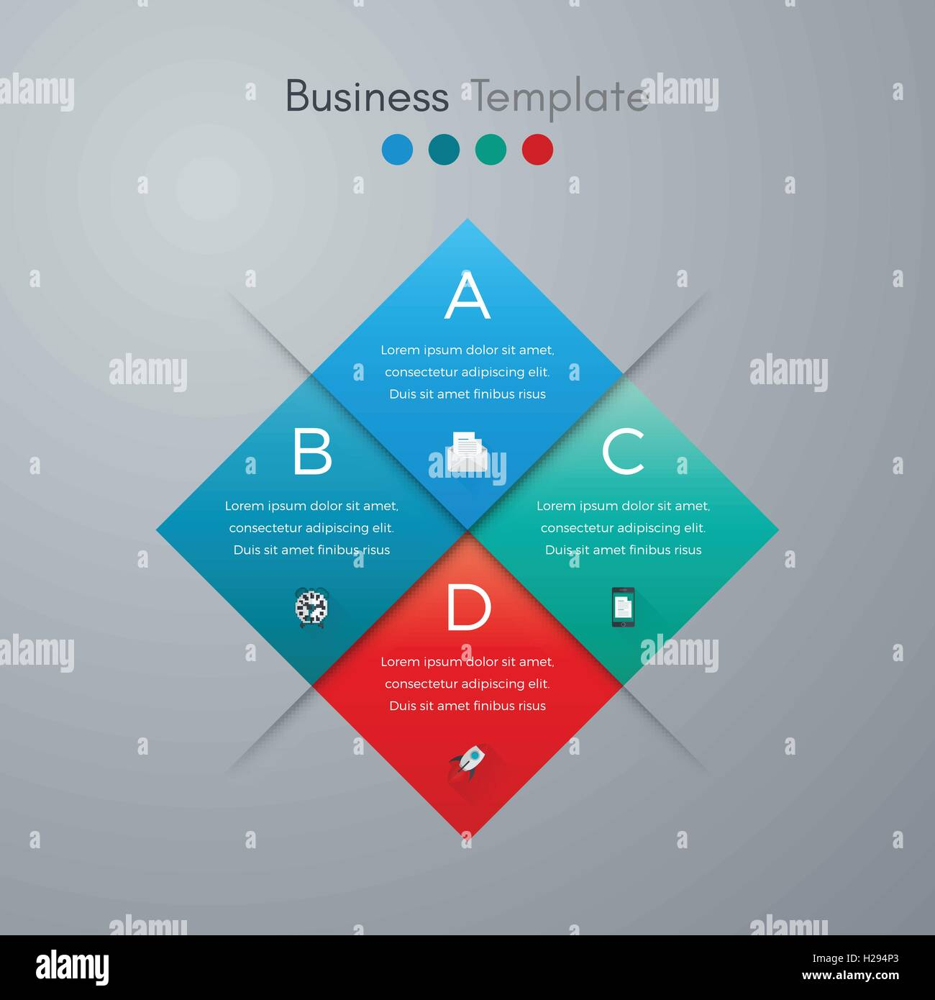

# AI có thể làm gì và không thể làm gì?

## **AI có thể làm gì cho bạn? (Cụ thể)**

- **Nghiên cứu:** "Tóm tắt 5 nghiên cứu mới nhất về tác dụng của Curcumin với bệnh viêm khớp."
- **Soạn thảo:** "Viết một bài giới thiệu phương pháp cấy chỉ cho bệnh nhân."
- **Tham khảo:** "Liệt kê các bài thuốc cổ phương trị chứng 'Tâm Thận bất giao'."
- **Dịch thuật:** "Dịch một tài liệu về huyệt vị từ tiếng Trung sang tiếng Việt."

## **Điều AI không thể làm (Và không bao giờ nên làm)**

### 🔍 **Vọng - Văn - Vấn - Thiết:**
AI không thể thay bạn bắt mạch, nhìn sắc diện hay lắng nghe tâm tư của bệnh nhân.

### ❤️ **Sự đồng cảm:**
AI không có trái tim để thấu hiểu nỗi đau và lo lắng.

### 🧠 **Trực giác của người thầy thuốc:**
Kinh nghiệm và sự nhạy bén của bạn là vô giá.

### ⚖️ **Chịu trách nhiệm pháp lý:**
Quyết định cuối cùng và trách nhiệm luôn thuộc về bạn.