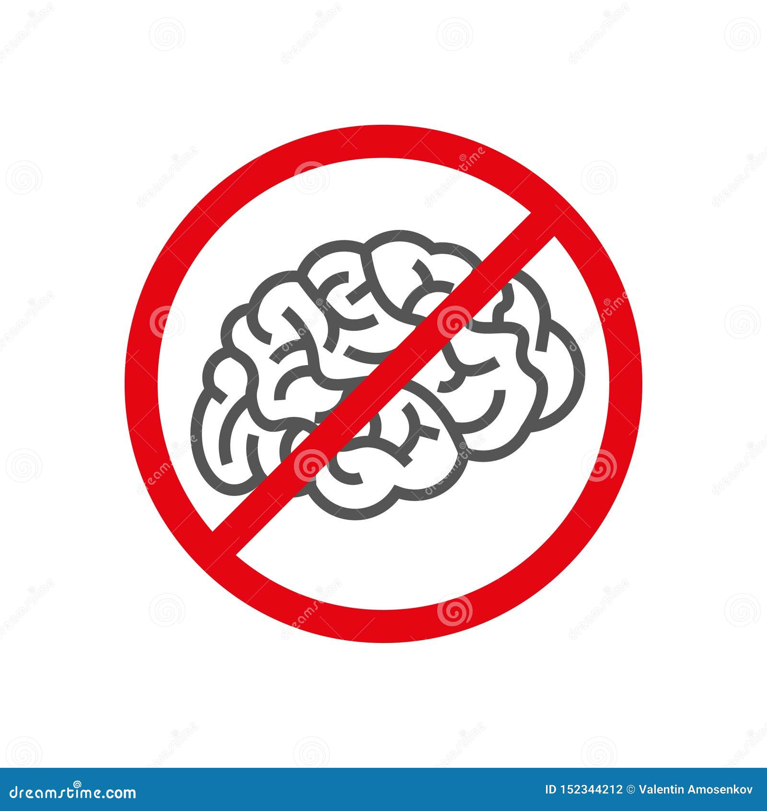

# Phá bỏ những lầm tưởng và Mục tiêu

## **Phá bỏ những lầm tưởng phổ biến**

### ❌ **"AI quá phức tạp"**
Nếu bạn dùng được Zalo, bạn dùng được AI. Giao diện rất đơn giản.

### ❌ **"AI sẽ thay thế tôi"**
Sai. AI sẽ thay thế những người không biết dùng AI. Nó là công cụ, không phải đối thủ.

### ❌ **"AI rất đắt đỏ"**
Có rất nhiều công cụ mạnh mẽ và hoàn toàn miễn phí để bắt đầu.

## **Mục tiêu của khóa học này**

### 🎯 **Hiểu rõ:**
Nắm vững AI là gì và hoạt động ra sao một cách đơn giản nhất.

### 🎯 **Làm chủ:**
Thành thạo kỹ năng "ra lệnh" (prompting) để AI trở thành trợ lý đắc lực.

### 🎯 **Ứng dụng:**
Tự tin áp dụng AI vào công việc hàng ngày, từ lâm sàng đến quản lý.

### 🎯 **An toàn:**
Sử dụng AI một cách có đạo đức, có trách nhiệm và bảo mật.