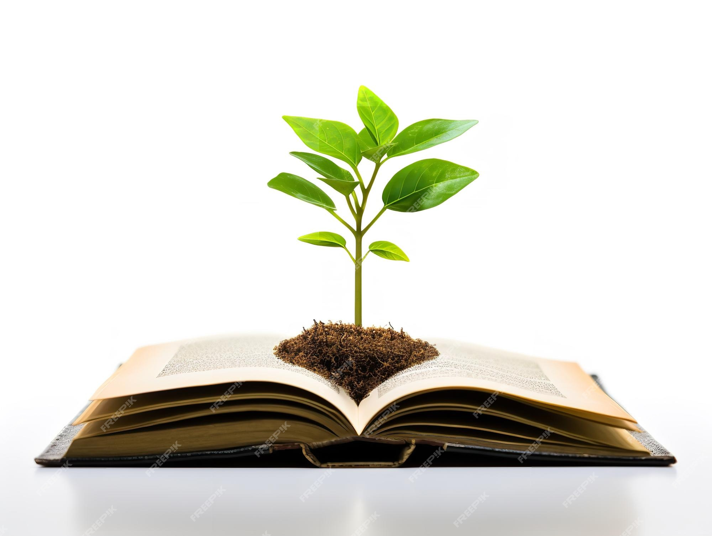

# Chuẩn bị cho hành trình

## **Chuẩn bị tâm thế cho hành trình**

### 🌟 **Tư duy cởi mở:**
Sẵn sàng tiếp nhận những ý tưởng mới.

### ⏱️ **Kiên nhẫn:**
Giống như học một phương thuốc mới, cần có thời gian để thành thạo.

### 🔬 **Không ngại sai:**
Thực hành và thử nghiệm là cách học tốt nhất.

### 🚀 **Hãy bắt đầu!**
Bước đầu tiên là bước quan trọng nhất.

---

## 🎉 **Chúc mừng!**
Bạn đã hoàn thành Chương 1 và sẵn sàng cho hành trình khám phá AI trong Y học Cổ truyền.

**Chương tiếp theo sẽ đưa bạn sâu hơn vào cách AI "tư duy" và học hỏi.**