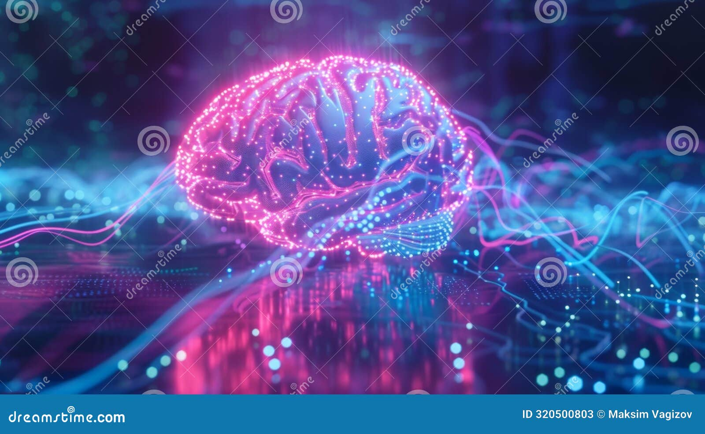

# LLM: "Bộ Não" của AI Tạo Sinh

**Hãy cùng khám phá bí mật đằng sau sức mạnh của AI hiện đại!**

## 🔢 **Quy mô khổng lồ:**

### **Large (Lớn):**
- GPT-3 có **175 tỷ tham số** (nơ-ron)
- GPT-4 ước tính **~1 nghìn tỷ** - một con số khổng lồ không thể tưởng tượng!

### **Language (Ngôn ngữ):**
- Nó "đọc" và "học" từ một kho dữ liệu văn bản khổng lồ
- Từ Wikipedia đến hàng triệu cuốn sách y khoa

### **Model (Mô hình):**
- Một hệ thống toán học phức tạp
- Được thiết kế để mô phỏng cách não bộ con người liên kết các ý tưởng và từ ngữ

## 💡 **Sức mạnh thực sự:**
- Đến từ quy mô không tưởng này
- Khả năng xử lý và hiểu ngữ cảnh ở mức độ mà con người chưa từng thấy

## 🎯 **Kết quả:**
Một "bộ não" điện tử có thể hiểu, phân tích và tạo ra nội dung y khoa chất lượng cao.