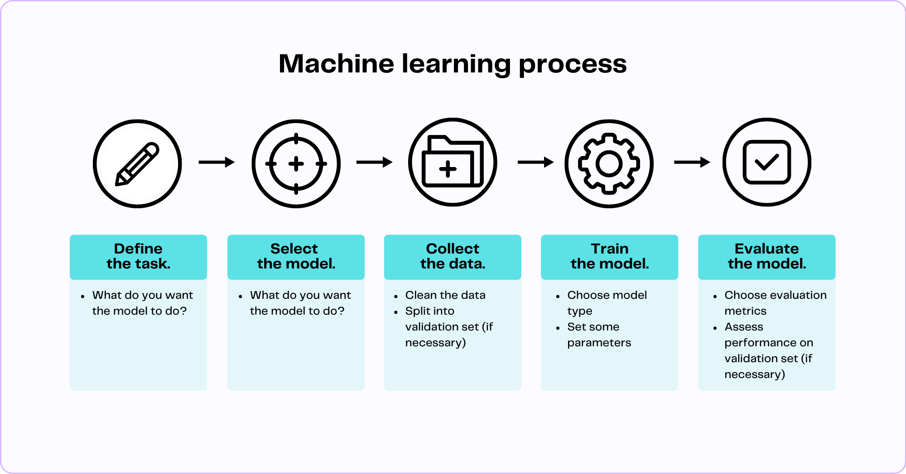

# Tóm Lược: Từ Dữ Liệu đến Đối Thoại Thông Minh

Hành trình để AI trả lời bạn là một chuỗi các bước phức tạp nhưng logic:

## 🔄 **7 Bước của quy trình AI:**

### 1️⃣ **Đào tạo nền:**
"Đọc" kho dữ liệu khổng lồ để học quy luật ngôn ngữ.

### 2️⃣ **Tinh chỉnh sâu:**
Được con người "dạy" để trở nên hữu ích và an toàn.

### 3️⃣ **Nhận Prompt & Ngữ cảnh:**
Tiếp nhận yêu cầu và toàn bộ lịch sử trò chuyện.

### 4️⃣ **Phân tích "Chú Ý":**
Xác định các từ khóa quan trọng nhất.

### 5️⃣ **Kích hoạt "Kinh nghiệm":**
Hàng tỷ tham số được huy động để tính toán.

### 6️⃣ **Lựa chọn & Sáng tạo:**
Chọn từ tiếp theo dựa trên xác suất và các tham số điều chỉnh.

### 7️⃣ **Tạo câu trả lời:**
Lặp lại bước 6 cho đến khi tạo ra một phản hồi hoàn chỉnh.

---

## 🎉 **Chúc mừng!**
Bạn đã hiểu được cách AI "tư duy" và xử lý thông tin.

**Chương tiếp theo sẽ dạy bạn cách "ra lệnh" cho AI một cách hiệu quả nhất.**