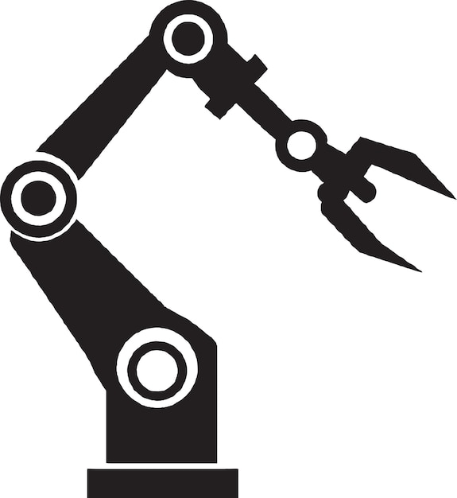
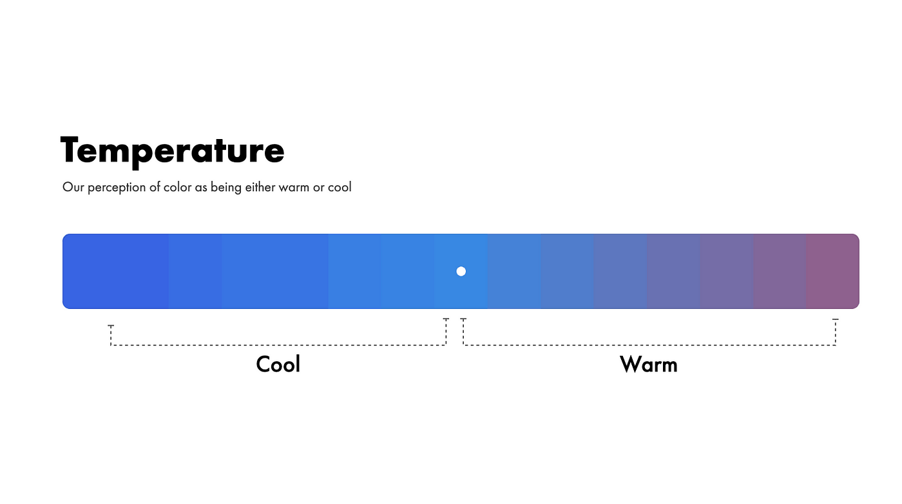

# Không chỉ là Xác Suất! Nghệ thuật của sự lựa chọn

Câu trả lời của AI có phải chỉ đơn thuần là chọn từ có xác suất xuất hiện cao nhất tiếp theo không? **Không hoàn toàn.**

## 📊 **Nền tảng là xác suất:**
Đúng là AI sẽ tính toán ra một danh sách các từ có khả năng xuất hiện tiếp theo cao nhất.

## 🎛️ **Nhưng có sự điều chỉnh:**
Các nhà phát triển sử dụng các **tham số** để điều chỉnh "tính cách" của câu trả lời.

### **Tham số `temperature` (Nhiệt độ):**

#### 🧊 **Temperature thấp:**
- AI sẽ luôn chọn từ an toàn, có xác suất cao nhất
- Câu trả lời sẽ chính xác nhưng có phần máy móc, lặp lại

#### 🔥 **Temperature cao:**
- AI sẽ "liều lĩnh" hơn, có thể chọn cả những từ có xác suất thấp hơn
- Tạo ra sự sáng tạo, bất ngờ
- Câu trả lời sẽ thú vị nhưng có nguy cơ "ảo giác" cao hơn

## 👨‍⚕️ **Tương tự như:**
- **Y sinh chỉ trả bài theo sách vở** (temperature thấp)
- **Danh y có thể ứng biến, gia giảm phương thuốc một cách sáng tạo** (temperature cao)

💡 **Lưu ý:** Các công cụ AI bạn dùng đã được cân bằng sẵn tham số này.