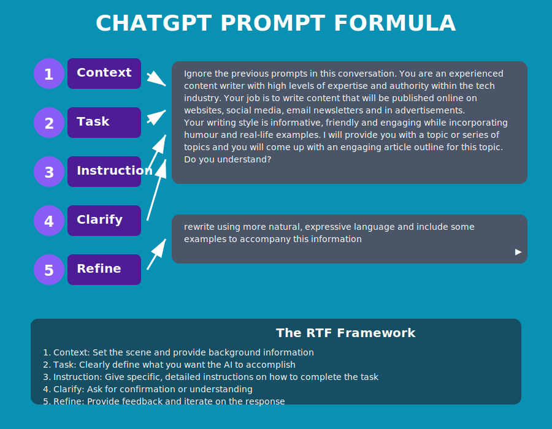

# Các "Tham Số" Tỷ Đô: Kinh Nghiệm được Số Hóa

Vậy 175 tỷ tham số của GPT-3 là gì?

## 🎛️ **Hãy tưởng tượng:**
Mỗi tham số là một **"núm vặn" vi mô** điều chỉnh mối quan hệ giữa các từ/ý tưởng.

## 🔧 **Ví dụ cụ thể:**
- Có một tham số điều chỉnh mối quan hệ giữa **"đau lưng"** và **"Thận"**
- Một tham số khác điều chỉnh mối quan hệ giữa **"ho khan"** và **"Phế"**

## ⚙️ **Quá trình đào tạo:**
Chính là việc dùng siêu máy tính để **tự động vặn hàng tỷ núm vặn này** sao cho:
- Khi AI nhận một câu hỏi
- Nó sẽ tạo ra câu trả lời giống với đáp án mẫu của con người nhất

## 💎 **Tóm lại:**
Hàng tỷ tham số này chính là **kiến thức và kinh nghiệm** đã được "số hóa" của AI.

---

> **Điều kỳ diệu:** Từ những con số khô khan, AI có thể tạo ra những câu trả lời sâu sắc về y học!