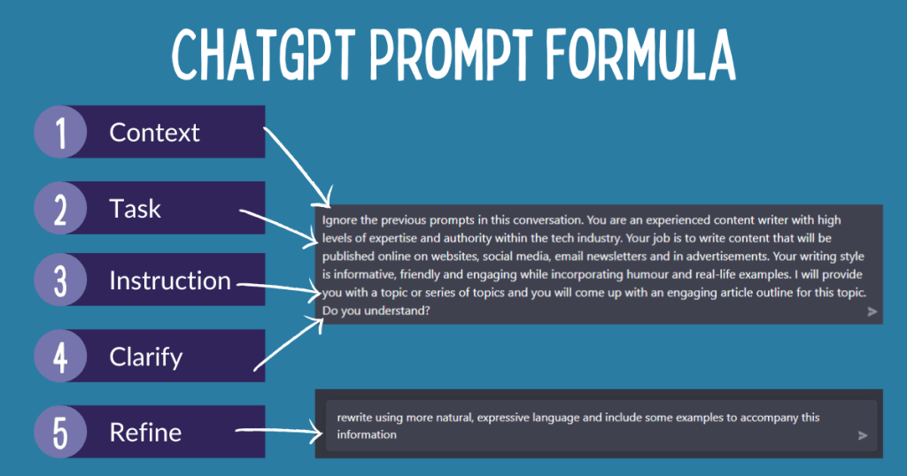

# Prompt và Ngữ Cảnh (Context): Lời Dặn và Bệnh Án

Đây là hai khái niệm cực kỳ quan trọng cần phân biệt rõ.

## 📝 **Prompt:**
- Là **lời dặn ban đầu**, là câu hỏi khởi đầu
- Là nhiệm vụ bạn giao cho AI trong một lượt nói
- *Ví dụ:* "Hãy liệt kê các vị thuốc có tác dụng bổ huyết."

## 🗂️ **Ngữ cảnh (Context):**
- Là **toàn bộ "bệnh án" của cuộc trò chuyện**
- Bao gồm prompt khởi đầu của bạn và tất cả các câu hỏi-đáp đã diễn ra trước đó

## 💡 **Ví dụ minh họa:**

### Cuộc hội thoại:
1. **Bạn:** "Bệnh nhân của tôi là nữ, hay bị chóng mặt, da xanh xao."
2. **AI:** "Các triệu chứng này có thể do huyết hư..."
3. **Bạn:** "Vậy **hãy liệt kê các vị thuốc có tác dụng bổ huyết.**"

### Phân tích:
- **Prompt:** Câu hỏi ở lượt 3
- **Ngữ cảnh:** Toàn bộ cuộc trò chuyện từ lượt 1-3
- Câu hỏi ở lượt 3 được hiểu trong *ngữ cảnh* của lượt 1
- Giúp AI đưa ra câu trả lời phù hợp với tình trạng bệnh nhân

---

> **Quan trọng:** Ngữ cảnh quyết định chất lượng của câu trả lời!