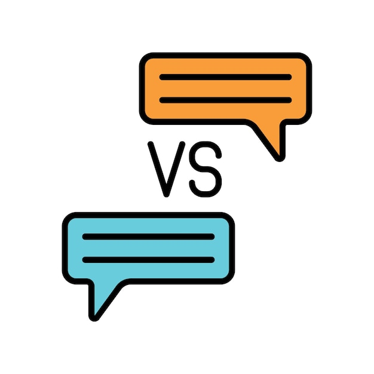

# Ngữ Cảnh Ảnh Hưởng Đến Câu Trả Lời Như Thế Nào?

Ngữ cảnh quyết định hoàn toàn chất lượng và sự phù hợp của câu trả lời.

## ❌ **Tình huống 1: Không có ngữ cảnh**

### Prompt:
*"Nên dùng bài thuốc nào?"*

### AI trả lời:
*"Tôi không thể đưa ra lời khuyên khi không biết tình trạng bệnh. Bạn cần cung cấp thêm thông tin..."*

**Kết quả:** Câu trả lời vô dụng

---

## ✅ **Tình huống 2: Có ngữ cảnh đầy đủ**

### Lượt 1 - Bạn:
*"Phân tích giúp tôi ca bệnh: Bệnh nhân nữ, 30 tuổi, hay cáu gắt, đau tức hạ sườn, kinh nguyệt không đều. YHCT gọi là chứng gì?"*

### Lượt 2 - AI:
*"Dựa trên các triệu chứng, đây có thể là chứng Can khí uất kết."*

### Lượt 3 - Bạn:
*"**Nên dùng bài thuốc nào?**"*

### AI trả lời:
*"Với chứng Can khí uất kết, bài thuốc kinh điển thường được sử dụng là Tiêu dao tán để sơ can giải uất, kiện tỳ dưỡng huyết..."*

**Kết quả:** Câu trả lời cực kỳ hữu ích

---

## 🎯 **Bài học quan trọng:**
**Ngữ cảnh đầy đủ = Câu trả lời chất lượng cao**