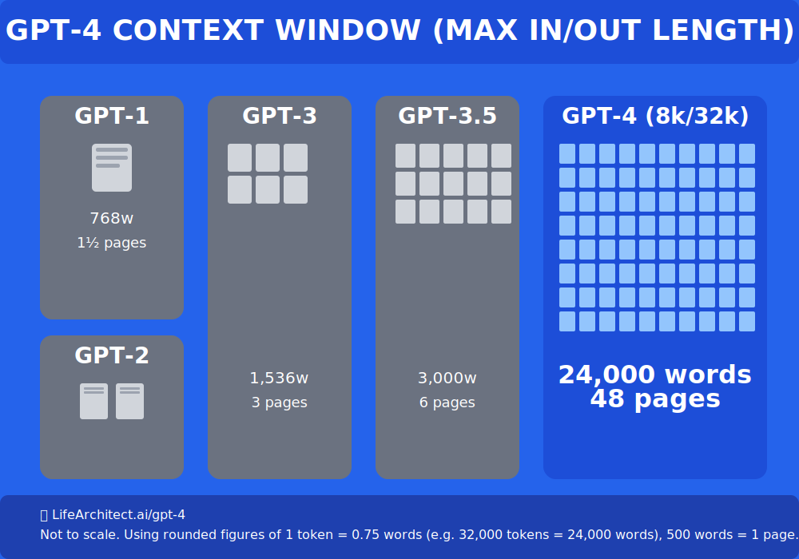

# Cửa sổ ngữ cảnh (Context Window): "Trí nhớ" của AI

## 🧠 **"Trí nhớ ngắn hạn" của AI:**
Là khả năng nhớ thông tin trong một cuộc trò chuyện.

## 📊 **So sánh các mô hình:**

### **GPT-4 (OpenAI):**
- Có thể nhớ khoảng **32,000 tokens** (~24,000 từ)

### **Claude 3 (Anthropic):**
- Có cửa sổ ngữ cảnh lên tới **200,000 tokens**!
- Tương đương khả năng "đọc" và "nhớ" toàn bộ một cuốn sách dày

## ⚠️ **Lưu ý quan trọng:**
Với các ca bệnh rất dài, AI có thể "quên" các chi tiết ở đầu cuộc trò chuyện.

## 💡 **Giải pháp:**
Khi đó, bạn cần **tóm tắt lại các triệu chứng chính** trong prompt của mình.

## 🔍 **Ví dụ thực tế:**
Thay vì dựa vào thông tin từ 50 câu trước đó, hãy viết:
*"Tóm tắt: Bệnh nhân nam, 45 tuổi, đau lưng mãn tính, sợ lạnh, mạch trầm chậm. Hiện tại bạn đang tư vấn về chế độ ăn uống..."*

---

> **Tip:** Luôn nhớ rằng AI cũng có giới hạn "trí nhớ" như con người!