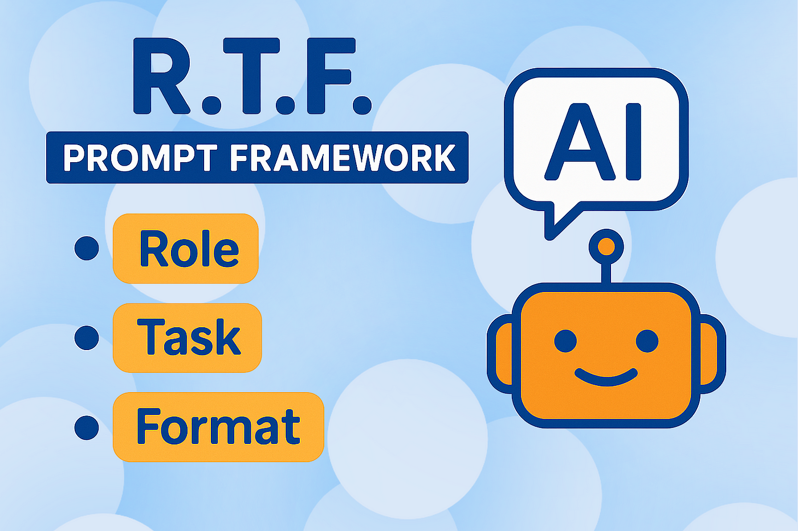

# Ôn lại cấu trúc Prompt hiệu quả (R-T-F)

> **Nền tảng vững chắc cho mọi cuộc đối화 với AI**

## 🎭 **Công thức R-T-F cần nhớ:**

### 🎯 **R - Role (Vai trò):**
- **Bạn muốn AI là ai?**
- *Ví dụ:* Lương y, nhà nghiên cứu, chuyên gia marketing, phiên dịch...
- **Tip:** Càng cụ thể vai trò, càng chính xác kết quả

### 📋 **T - Task (Nhiệm vụ):**
- **Bạn muốn AI làm gì?**
- *Ví dụ:* Phân tích, so sánh, soạn thảo, lên danh sách, tóm tắt...
- **Tip:** Sử dụng động từ rõ ràng, tránh mơ hồ

### 📊 **F - Format (Định dạng):**
- **Bạn muốn kết quả trông như thế nào?**
- *Ví dụ:* Bảng, gạch đầu dòng, email, bài thơ, sơ đồ...
- **Tip:** Định dạng rõ ràng giúp AI tập trung hơn

## 💡 **Quy tắc vàng:**
**Luôn bắt đầu suy nghĩ về prompt theo 3 yếu tố R-T-F** - Đây là nền móng cho mọi prompt hiệu quả.

---

> **Nhớ kỹ:** R-T-F là chìa khóa để mở khóa sức mạnh của AI!