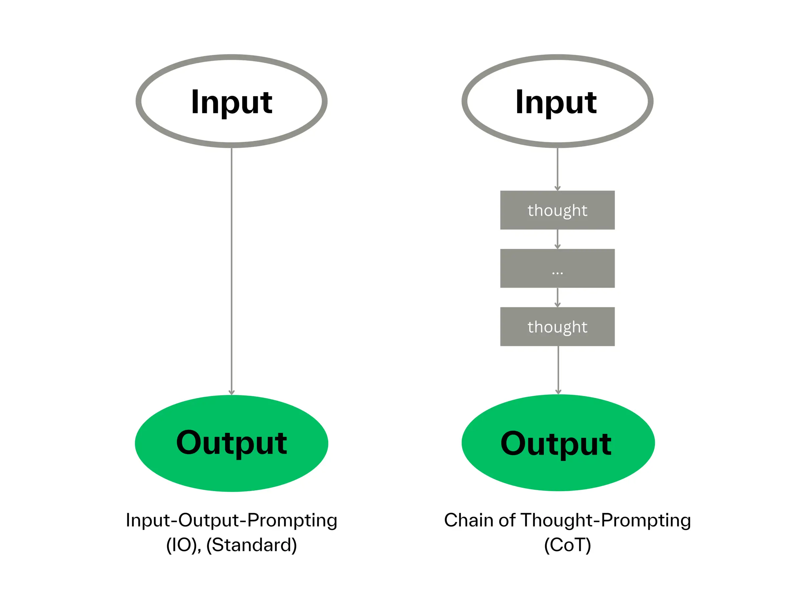

# Kỹ thuật 2: Chuỗi tư duy (Chain-of-Thought)



## 🧠 **Nguyên lý cốt lõi:**
Với nhiệm vụ phức tạp, đừng yêu cầu AI trả lời ngay. Hãy yêu cầu nó **"suy nghĩ từng bước một"**.

## 📝 **Ví dụ prompt Chain-of-Thought:**

```
"Phân tích ca bệnh sau. **Hãy suy nghĩ từng bước một.**

Đầu tiên, liệt kê các triệu chứng chính.
Thứ hai, biện luận theo tạng phủ.
Cuối cùng, đề xuất bài thuốc."
```

## 🎯 **Lợi ích của kỹ thuật này:**

### ✅ **Tư duy logic:**
Buộc AI phải tư duy có hệ thống, giảm đáng kể sai sót.

### ✅ **Theo dõi được quá trình:**
Bạn có thể thấy AI "suy nghĩ" như thế nào.

### ✅ **Dễ kiểm tra:**
Nếu bước nào sai, bạn có thể chỉ ra và yêu cầu sửa.

### ✅ **Kết quả chính xác hơn:**
Phân tích từng bước giúp tránh kết luận vội vàng.

## 🔍 **Ví dụ so sánh:**

### ❌ **Prompt thường:**
*"Bài thuốc gì trị chứng này?"*

### ✅ **Prompt Chain-of-Thought:**
*"Hãy phân tích từng bước: 1) Xác định chứng, 2) Chọn pháp trị, 3) Đề xuất bài thuốc"*

---

> **Lưu ý:** Kỹ thuật này đặc biệt hiệu quả với các ca bệnh phức tạp!