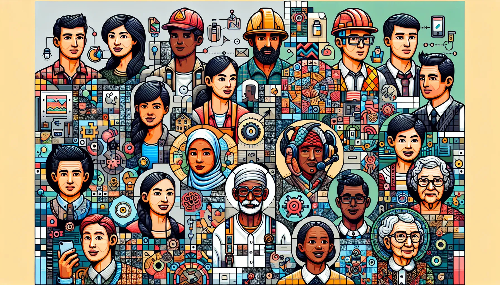

# Kỹ thuật 3: Xây dựng Persona (Nhân vật) chi tiết



## 🎭 **Đừng chỉ nói "đóng vai lương y"**
Hãy chi tiết hơn để AI thực sự "nhập vai"!

## 📝 **Ví dụ Persona chi tiết:**

### ❌ **Prompt đơn giản:**
*"Hãy đóng vai một lương y."*

### ✅ **Prompt Persona chi tiết:**
```
"Hãy đóng vai một lương y 40 năm kinh nghiệm, 
chuyên về các bệnh của phụ nữ, có văn phong từ tốn, 
uyên bác nhưng dễ hiểu. Mục tiêu của bạn là trấn an 
và giáo dục bệnh nhân."
```

## 🔧 **Các yếu tố của Persona tốt:**

### 📅 **Kinh nghiệm:**
- "40 năm kinh nghiệm"
- "Từng làm việc tại bệnh viện lớn"

### 🎯 **Chuyên môn:**
- "Chuyên về phụ khoa"
- "Giỏi về châm cứu"

### 💬 **Phong cách giao tiếp:**
- "Văn phong từ tốn"
- "Giải thích dễ hiểu"

### ❤️ **Mục tiêu:**
- "Trấn an bệnh nhân"
- "Giáo dục sức khỏe"

## 🌟 **Kết quả:**
Persona càng chi tiết, câu trả lời của AI càng có "hồn" và phù hợp với tình huống cụ thể.

---

> **Tip:** Hãy tưởng tượng một người thầy thuốc cụ thể mà bạn kính trọng và mô tả họ cho AI!