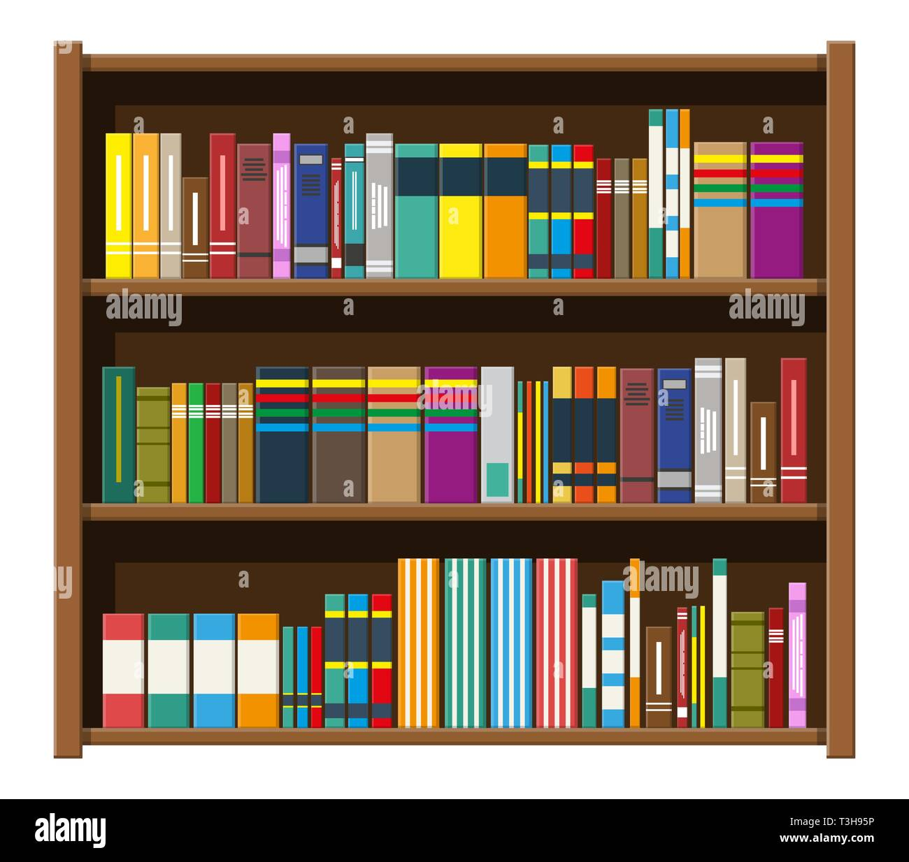

# Tạo "Thư viện Prompt" của riêng bạn



## 💾 **Khi bạn tạo ra một prompt hiệu quả, đừng để nó trôi đi!**

### 📁 **Cách tổ chức Thư viện Prompt:**

#### 1. **Chọn nơi lưu trữ:**
- File Word/Google Docs
- Ứng dụng ghi chú (Notion, Obsidian)
- Sổ tay giấy truyền thống

#### 2. **Phân loại theo chủ đề:**
- 🏥 **Chẩn đoán:** Prompts phân tích triệu chứng
- 💊 **Tư vấn bệnh nhân:** Prompts giải thích điều trị
- 📱 **Marketing:** Prompts viết content
- 📚 **Nghiên cứu:** Prompts tóm tắt tài liệu

#### 3. **Template mẫu:**
```
📝 PROMPT: [Tên prompt]
🎯 MỤC ĐÍCH: [Dùng khi nào]
📋 NỘI DUNG: [Prompt đầy đủ]
✅ KẾT QUẢ: [Ghi chú về hiệu quả]
📅 NGÀY TẠO: [Để theo dõi]
```

## 🔄 **Cập nhật và cải thiện:**

### **Liên tục tinh chỉnh:**
- Prompt nào hay → lưu lại
- Prompt nào chưa tốt → sửa và lưu phiên bản mới
- Chia sẻ với đồng nghiệp để học hỏi

## 🏆 **Kết quả sau vài tháng:**
Bạn sẽ có một **"bảo bối"** giúp tiết kiệm hàng giờ làm việc mỗi ngày!

---

> **Tip Pro:** Bắt đầu với 5-10 prompts cơ bản, rồi từ từ mở rộng thư viện!