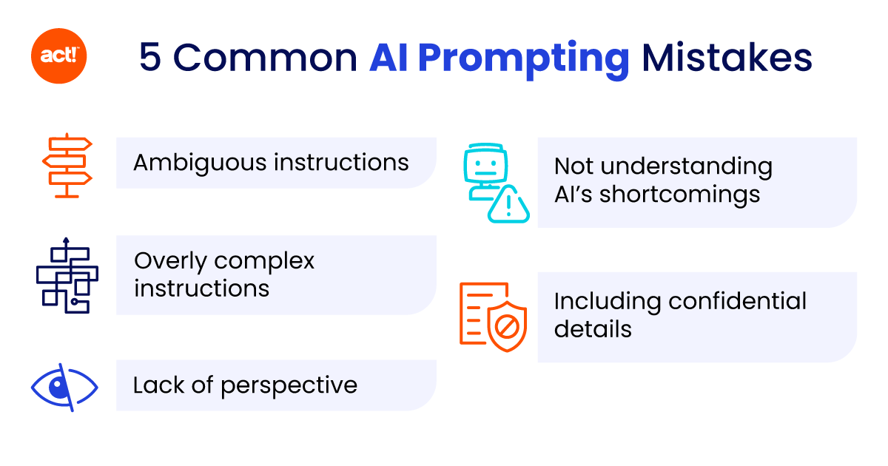

# Những lỗi cần tránh khi viết Prompt

## ❌ **4 lỗi phổ biến cần tránh:**

### 1. **🌫️ Mơ hồ:**
**Lỗi:** *"Nói về bệnh mất ngủ."*

**Sửa:** *"Liệt kê 5 nguyên nhân gây mất ngủ ở người trung niên và cách điều trị bằng YHCT."*

---

### 2. **📚 Quá tải:**
**Lỗi:** *"Phân tích ca bệnh, đề xuất thuốc, viết đơn, tư vấn chế độ ăn, lên kế hoạch tập luyện và giải thích cho bệnh nhân."*

**Sửa:** Tách thành 3-4 prompts riêng biệt.

---

### 3. **⚖️ Mâu thuẫn:**
**Lỗi:** *"Viết thật ngắn gọn nhưng phải thật chi tiết."*

**Sửa:** *"Viết 1 đoạn ngắn (100 từ) tóm tắt các điểm chính."*

---

### 4. **🔮 Giả định AI biết mọi thứ:**
**Lỗi:** *"Phân tích ca bệnh này."* (không đưa thông tin ca bệnh)

**Sửa:** Luôn cung cấp đầy đủ ngữ cảnh cần thiết.

## 💡 **Nguyên tắc CLEAR:**

- **C**oncise (Súc tích)
- **L**ogical (Logic)
- **E**xplicit (Rõ ràng)
- **A**ctionable (Có thể thực hiện)
- **R**elevant (Liên quan)

---

> **Nhớ:** Prompt tốt là prompt mà người khác đọc cũng hiểu ngay bạn muốn gì!