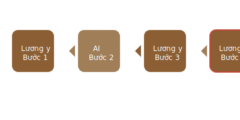

# Luồng làm việc an toàn với AI trong chẩn đoán

> **An toàn là ưu tiên số 1 - AI chỉ là cố vấn, không bao giờ thay thế lương y**

## 🛡️ **Quy trình 4 bước BẢNG VÀNG:**

### 1. **👨‍⚕️ Bước 1 (Lương y chủ động):**
- **Khám bệnh trực tiếp** (Tứ chẩn: Vọng, Văn, Vấn, Thiết)
- **Thu thập thông tin gốc** từ bệnh nhân
- **Đưa ra chẩn đoán sơ bộ** dựa trên kinh nghiệm

### 2. **🤖 Bước 2 (AI hỗ trợ):**
- Sử dụng AI như **người cố vấn chuyên môn**
- Nhập thông tin **đã ẩn danh hóa** để bảo mật
- **Tham khảo, tìm kiếm, so sánh** các phương án

### 3. **🔍 Bước 3 (Lương y phân tích):**
- **Sàng lọc thông tin** từ AI một cách cẩn thận
- **Đối chiếu** với kiến thức và kinh nghiệm lâm sàng
- **Loại bỏ** những gợi ý không phù hợp

### 4. **✅ Bước 4 (Lương y quyết định):**
- **Người duy nhất** đưa ra quyết định cuối cùng
- **Chịu trách nhiệm** hoàn toàn về chẩn đoán và điều trị
- **AI không bao giờ** thay thế được vai trò này

## ⚠️ **Nguyên tắc quan trọng:**
- **Bệnh nhân luôn là trung tâm**
- **Lương y luôn kiểm soát quy trình**
- **AI chỉ là công cụ hỗ trợ**