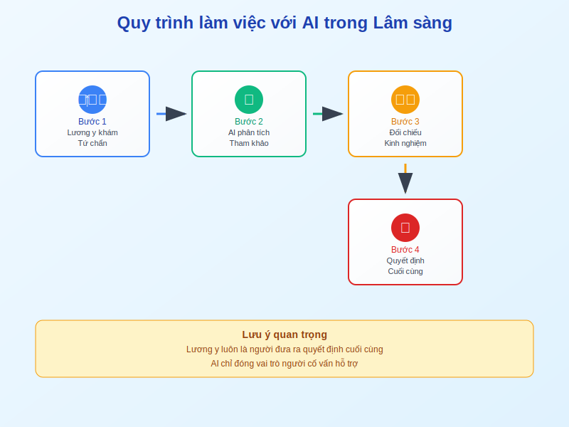

# Case Study 1: Chứng Mất Ngủ (Thất miên)



## 📋 **Tình huống:**
Bệnh nhân nữ, 50 tuổi, mất ngủ sau mãn kinh, khó vào giấc, hay tỉnh giấc, kèm bốc hỏa, ra mồ hôi trộm, lòng bàn tay chân nóng, miệng khô, lưỡi đỏ ít rêu.

## 💻 **Câu lệnh Prompt chi tiết:**

```
"Hãy đóng vai một danh y YHCT. Phân tích ca bệnh sau và tư vấn. 
Hãy suy nghĩ từng bước một:

1. Dựa trên các triệu chứng (nữ, 50t, mất ngủ, bốc hỏa, đạo hãn, 
   ngũ tâm phiền nhiệt), biện chứng đây là hội chứng gì theo tạng phủ? 
   Giải thích ngắn gọn cơ chế.

2. Đề xuất một bài thuốc cổ phương kinh điển phù hợp nhất và các vị 
   thuốc có thể gia giảm để tăng hiệu quả an thần.

3. Gợi ý 3 huyệt vị chính để bệnh nhân có thể tự day ấn tại nhà 
   nhằm cải thiện giấc ngủ.

4. Soạn 3 lời khuyên về chế độ ăn uống và sinh hoạt.

Trình bày với văn phong từ tốn, giải thích rõ ràng cho người 
không có chuyên môn."
```

## 🎯 **Phân tích lợi ích của AI:**

### **Hệ thống hóa kiến thức:**
AI giúp xâu chuỗi các triệu chứng rời rạc thành một hội chứng cụ thể (Tâm Thận bất giao, Âm hư hỏa vượng) một cách nhanh chóng.

### **Mở rộng phương án:**
Thay vì chỉ nhớ 1-2 bài thuốc, AI có thể gợi ý nhiều phương án gia giảm khác nhau, hoặc các phương pháp không dùng thuốc.

### **Tạo tài liệu cho bệnh nhân:**
AI soạn sẵn các lời khuyên dễ hiểu, giúp bạn tiết kiệm thời gian và tăng sự tuân thủ điều trị.