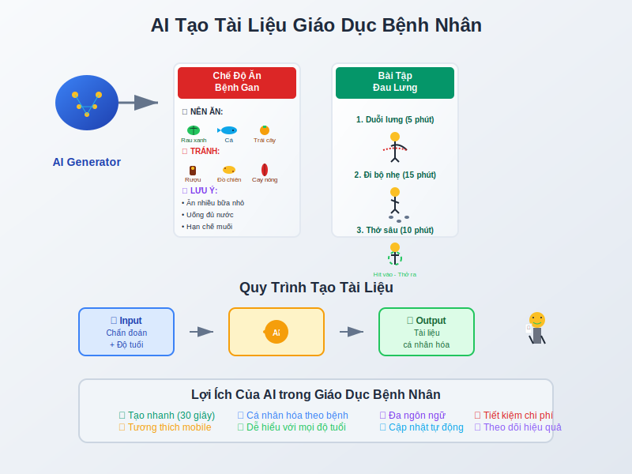

# Case Study 2: Đau Thần Kinh Tọa (Tọa cốt phong)


## 📋 **Tình huống:**
Bệnh nhân nam, 45 tuổi, làm nghề lái xe, đau nhói từ thắt lưng lan xuống mặt sau đùi và cẳng chân phải, đi lại khó khăn, trời lạnh đau tăng, rêu lưỡi trắng mỏng.

## 🎯 **Phân tích lợi ích của AI:**

### **Toàn diện và chi tiết:**
AI giúp bạn nhanh chóng lập ra một kế hoạch điều trị đa phương thức (Thuốc - Châm cứu - Lối sống) một cách có hệ thống.

### **Hỗ trợ học thuật:**
Yêu cầu AI giải thích vai trò của các vị thuốc giúp bạn củng cố và ôn lại kiến thức ngay trong lúc làm việc.

### **Cá nhân hóa:**
Dựa trên nghề nghiệp (lái xe), AI có thể đưa ra những lời khuyên rất cụ thể và thiết thực về tư thế ngồi.

---

# Case Study 3: Rối Loạn Tiêu Hóa (Tỳ Vị hư hàn)



## 📋 **Tình huống:**
Bệnh nhân nữ, 28 tuổi, nhân viên văn phòng, hay bị đầy bụng, khó tiêu sau khi ăn, ăn đồ lạnh vào là đau bụng đi ngoài, phân lỏng, người mệt mỏi, chân tay lạnh, sắc mặt nhợt nhạt.

## 🎯 **Phân tích lợi ích của AI:**

### **Chuyên môn hóa sâu:**
AI có thể nhanh chóng tạo ra một thực đơn chi tiết, điều mà một lương y có thể không có đủ thời gian để làm trong một buổi khám.

### **Sáng tạo trong diễn đạt:**
AI rất giỏi trong việc tạo ra các phép ẩn dụ, so sánh (ví Tỳ Vị như bếp lửa) giúp bệnh nhân dễ hình dung và tuân thủ điều trị tốt hơn.

### **Tiết kiệm công sức:**
Thay vì tự mình tra cứu và lên thực đơn, bạn có thể có một bản nháp chất lượng chỉ trong vài giây, sau đó chỉnh sửa lại cho phù hợp.

## 💻 **Prompt mẫu cho Rối loạn tiêu hóa:**

```
"Hãy đóng vai một chuyên gia dinh dưỡng kết hợp với lương y YHCT. 
Tôi có một bệnh nhân với tình trạng Tỳ Vị hư hàn:

- Nữ, 28 tuổi, nhân viên văn phòng
- Triệu chứng: đầy bụng, khó tiêu, ăn lạnh đau bụng, phân lỏng
- Thể trạng: mệt mỏi, chân tay lạnh, sắc mặt nhợt

Hãy tạo một thực đơn 7 ngày với các nguyên tắc:
1. Thực phẩm ấm tính, dễ tiêu
2. Tránh thực phẩm hàn tính
3. Phù hợp với công việc bận rộn

Trình bày dưới dạng bảng, có giải thích ngắn về lợi ích từng món."
```

## 🌟 **Kết quả mong đợi:**
- Thực đơn chi tiết 7 ngày
- Giải thích rõ ràng cho bệnh nhân
- Dễ áp dụng trong cuộc sống bận rộn
- Phù hợp với nguyên lý YHCT