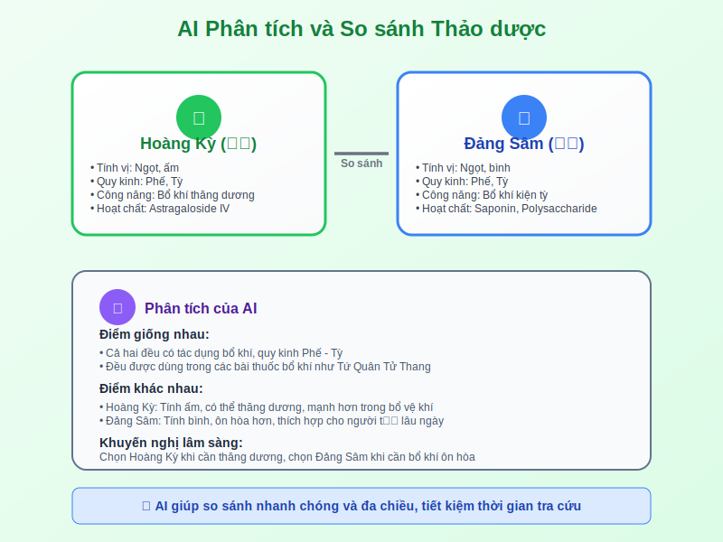

# Case Study 4: Trứng Cá (Thấp nhiệt ở bì phu)



## 📋 **Tình huống:**
Bệnh nhân nam, 22 tuổi, sinh viên, da mặt và lưng nhiều mụn trứng cá, một số mụn có mủ, da dầu nhiều, hay thức khuya, ăn cay nóng, lưỡi đỏ rêu vàng.

## 💻 **Câu lệnh Prompt cho so sánh bài thuốc:**

```
"Hãy đóng vai một lương y có 30 năm kinh nghiệm về da liễu YHCT. 
Tôi có bệnh nhân nam 22 tuổi với trứng cá viêm:

Triệu chứng: mụn mặt và lưng có mủ, da dầu, thức khuya, ăn cay, 
lưỡi đỏ rêu vàng.

Hãy so sánh 3 bài thuốc phù hợp trong bảng sau:

| Tiêu chí so sánh | Ngũ Vị Tiêu Độc Ẩm | Phòng Phong Thông Thánh Tán | Thanh Thượng Phòng Phong Thang |
|------------------|---------------------|------------------------------|--------------------------------|
| Chủ trị chính    |                     |                              |                                |
| Cơ chế tác dụng  |                     |                              |                                |
| Phù hợp khi nào  |                     |                              |                                |
| Thành phần chính |                     |                              |                                |
| Lưu ý sử dụng    |                     |                              |                                |

Sau đó khuyến nghị bài thuốc tốt nhất cho ca này và lý do."
```

## 🎯 **Lợi ích của việc so sánh bằng bảng:**

### **Trực quan và dễ hiểu:**
Thông tin được tổ chức một cách khoa học, giúp bạn nhanh chóng nhận ra điểm khác biệt giữa các phương án.

### **Hỗ trợ ra quyết định:**
AI sẽ đưa ra khuyến nghị kèm lý do cụ thể, giúp bạn có thêm góc nhìn để đưa ra quyết định cuối cùng.

### **Tăng tính chuyên nghiệp:**
Bảng so sánh có thể được sử dụng để giải thích cho bệnh nhân hoặc thực tập sinh về lý do lựa chọn bài thuốc.

## 🌿 **Gợi ý phương pháp dùng ngoài:**

### **Prompt bổ sung:**

```
"Ngoài uống thuốc, hãy gợi ý 3 phương pháp dùng ngoài từ thảo dược 
tự nhiên để hỗ trợ điều trị trứng cá:

1. Công thức nước rửa mặt từ thảo dược
2. Mặt nạ tự nhiên có thể làm tại nhà  
3. Nước xông hơi thảo dược

Mỗi phương pháp nêu rõ: nguyên liệu, cách làm, tần suất sử dụng 
và cơ chế tác dụng theo YHCT."
```

## ⚗️ **Ứng dụng thực tế:**

### **Kết hợp Đông - Tây:**
- AI có thể gợi ý cách kết hợp thảo dược với các phương pháp chăm sóc da hiện đại
- Tạo ra kế hoạch điều trị toàn diện từ trong ra ngoài

### **Giáo dục bệnh nhân:**
- Giải thích cơ chế bệnh theo YHCT một cách dễ hiểu
- Cung cấp lời khuyên về chế độ ăn uống và sinh hoạt phù hợp

### **Theo dõi tiến triển:**
- Hướng dẫn bệnh nhân nhận biết dấu hiệu cải thiện
- Khi nào cần điều chỉnh phương pháp điều trị